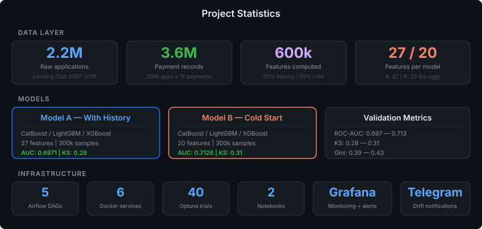
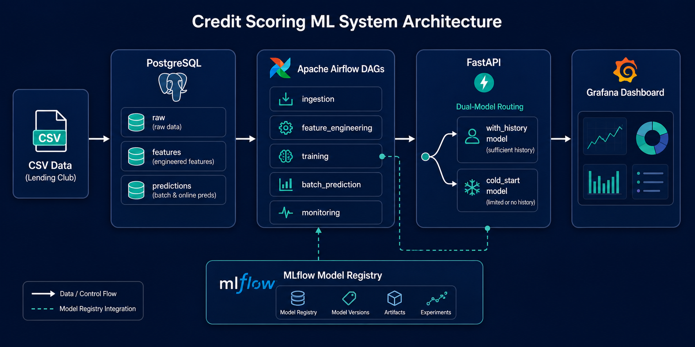
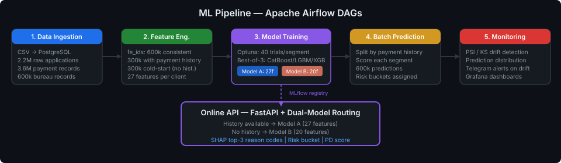
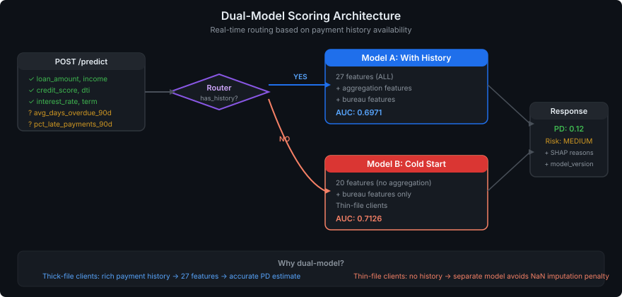

<div align="center">

# 🏦 Credit Scoring System (PD)

### End-to-end ML pipeline for Probability of Default scoring with dual-model architecture

[](https://python.org)
[](https://airflow.apache.org)
[](https://mlflow.org)
[](https://fastapi.tiangolo.com)
[](https://postgresql.org)
[](https://docker.com)
[]()

</div>

---

## 🎯 Overview

Production-grade credit scoring system that predicts **probability of default** for loan applicants. Built with a **dual-model architecture** — the industry-standard approach used by banks to score thick-file (established) and thin-file (new) clients separately.

```
Lending Club CSV → PostgreSQL → Airflow DAGs → CatBoost / LightGBM / XGBoost → MLflow → FastAPI → Grafana
```

## 📊 Project Statistics

<p align="center">
  
</p>

## 🏗️ Architecture

<p align="center">
  
</p>

<details>
<summary><b>📋 Technical Components</b></summary>

| Component | Technology | Purpose |
|-----------|-----------|---------|
| **Data Lake** | PostgreSQL 15 | 2.2M raw applications + synthetic history |
| **Orchestration** | Apache Airflow 2.8.1 | 5 DAGs: ingestion → features → training → scoring → monitoring |
| **ML Models** | CatBoost, LightGBM, XGBoost | Best-of-3 per segment, Optuna (40 trials) |
| **Experiment Tracking** | MLflow 2.14.3 | Model registry with aliases |
| **Serving** | FastAPI | Dual-model routing, SHAP explanations |
| **Monitoring** | Grafana + Telegram | PSI/KS drift detection, PD distribution |
| **Explainability** | SHAP | Top-3 reason codes per prediction |

</details>

## 🔄 Pipeline Flow

<p align="center">
  
</p>

## 🤖 Dual-Model Architecture

This is the key differentiator. Real banks don't use one model for everyone — they score **thick-file** clients (with credit history) and **thin-file** clients (no history) with separate models.

<p align="center">
  
</p>

<details>
<summary><b>🔬 Why dual-model?</b></summary>

| Problem | Single model approach | Our dual-model approach |
|---------|----------------------|------------------------|
| Client with history | Gets all features, good prediction | ✅ Model A: 27 features, AUC 0.697 |
| New client (no history) | Aggregation features = 0/NaN → noisy prediction | ✅ Model B: 20 features, AUC 0.713 |
| Fairness | Thin-file clients penalized by missing features | ✅ Separate model learns thin-file patterns |
| Business value | One-size-fits-all | ✅ Optimized per segment |

</details>

## 📚 Notebooks

| # | Notebook | Description |
|---|----------|-------------|
| 01 | [`01_EDA.ipynb`](notebooks/01_EDA.ipynb) | Temporal distribution analysis, missing values, outliers, correlation, PSI, feature importance |
| 02 | [`03_SHAP_analysis.ipynb`](notebooks/03_SHAP_analysis.ipynb) | SHAP explanations for both segment models, dependence plots |

## 🚀 Quick Start

### Local (no Docker)

```bash
python3.11 -m venv .venv && source .venv/bin/activate
pip install -r requirements/requirements-local.txt
export PYTHONPATH=.
python scripts/generate_sample_data.py --n 3000
python scripts/run_local_pipeline.py
pytest tests/ -q
```

### Docker (full stack)

```bash
cp .env.example .env
docker compose up -d
```

| Service | URL | Credentials |
|---------|-----|-------------|
| **Airflow** | http://localhost:8080 | admin / admin |
| **MLflow** | http://localhost:5000 | — |
| **API** | http://localhost:8000/docs | — |
| **Grafana** | http://localhost:3000 | admin / admin |

### Run DAGs

```bash
# Sequential execution
docker compose exec airflow-scheduler airflow dags trigger data_ingestion
docker compose exec airflow-scheduler airflow dags trigger feature_engineering
docker compose exec airflow-scheduler airflow dags trigger model_training
docker compose exec airflow-scheduler airflow dags trigger batch_prediction
docker compose exec airflow-scheduler airflow dags trigger monitoring
curl -X POST http://localhost:8000/reload
```

## 🌐 API Examples

<details>
<summary><b>Request with payment history → Model A</b></summary>

```bash
curl -X POST http://localhost:8000/predict \
  -H "Content-Type: application/json" \
  -d '{
    "application_id": 1,
    "loan_amount": 15000, "income": 60000, "loan_term": 36,
    "interest_rate": 12.5, "employment_years": 5, "credit_score": 700,
    "dti_ratio": 20, "num_open_accounts": 5, "num_delinquencies": 0,
    "total_credit_limit": 50000,
    "home_ownership": "RENT", "purpose": "debt_consolidation",
    "avg_days_overdue_90d": 5.2,
    "pct_late_payments_90d": 0.15
  }'
```
→ `model_version: "with_history:mlflow:champion"`

</details>

<details>
<summary><b>Request without history → Model B</b></summary>

```bash
curl -X POST http://localhost:8000/predict \
  -H "Content-Type: application/json" \
  -d '{
    "application_id": 2,
    "loan_amount": 10000, "income": 45000, "loan_term": 36,
    "interest_rate": 15.0, "employment_years": 2, "credit_score": 650,
    "dti_ratio": 30, "num_open_accounts": 3, "num_delinquencies": 1,
    "total_credit_limit": 25000,
    "home_ownership": "RENT", "purpose": "credit_card"
  }'
```
→ `model_version: "cold_start:mlflow:champion"`

</details>

## 📁 Project Structure

```
├── dags/                          # Airflow DAGs
│   ├── dag_data_ingestion.py      #   1. CSV → PostgreSQL + synthetic history
│   ├── dag_feature_engineering.py #   2. fe_ids → numerical / agg / TE / bureau
│   ├── dag_training.py            #   3. Dual-model: Optuna + best-of-3
│   ├── dag_batch_prediction.py    #   4. Score all by segment
│   └── dag_monitoring.py          #   5. PSI/KS drift + Telegram alerts
├── src/
│   ├── config.py                  # Central configuration
│   ├── data/                      # Ingestion, queries, validation
│   ├── features/                  # Numerical, aggregation, bureau, target encoding
│   ├── models/scoring/            # Train, hyperopt, ensemble, artifacts, SHAP
│   ├── serving/                   # FastAPI app + dual-model predictor
│   └── monitoring/                # PSI drift detection
├── notebooks/                     # EDA, experiments, SHAP analysis
├── scripts/                       # Learning curve, data generation, telegram notifier
├── sql/                           # Schema: raw → features → predictions → monitoring
├── docker/                        # Dockerfiles + Airflow constraints
├── configs/                       # YAML configs (model, features, monitoring)
├── monitoring/grafana/            # Dashboard JSON + provisioning
├── docs/                          # Architecture, model card, features, diagrams
├── tests/                         # Unit tests (features, models, API, PSI, leakage)
└── requirements/                  # Pinned deps (airflow, api, local, dev)
```

## 📖 Documentation

| Document | Description |
|----------|-------------|
| [Architecture](docs/architecture.md) | System design, data flow, dual-model details |
| [Model Card](docs/model_card.md) | Model details, metrics, limitations, ethics |
| [Feature Documentation](docs/feature_documentation.md) | All 23 features with formulas |
| [System Overview](docs/SYSTEM_OVERVIEW.md) | Component map, health checklist |
| [Lending Club](docs/LENDING_CLUB.md) | Data source reference |

## 🧪 Key Engineering Decisions

| Decision | Why | Portfolio Value |
|----------|-----|----------------|
| Dual-model serving | Banks use separate models for thick/thin-file | Shows domain knowledge |
| fe_ids consistency | All FE tasks use same IDs → no merge mismatches | Production thinking |
| Optuna on segment data | Params optimized per-segment, not on full dataset | Methodology rigor |
| Conditional calibration | Only calibrate if it improves AUC | Pragmatic ML |
| Time-window statistical proof | Chi-squared, KS, PSI tests justify 2015-2018 window | Data-driven decisions |
| Sequential DAG tasks | Avoids Postgres shared memory exhaustion on weak PC | Infrastructure awareness |
| Named Docker volume | Avoids bind mount permission issues | DevOps experience |

## 📄 License

Educational / portfolio project. Not intended for production credit decisions.
